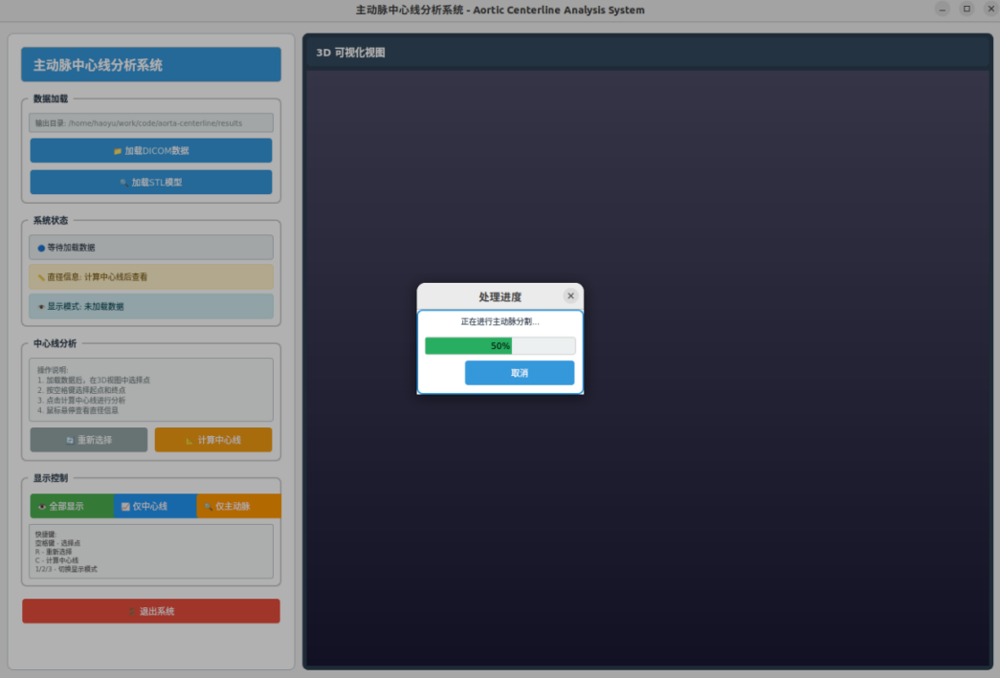
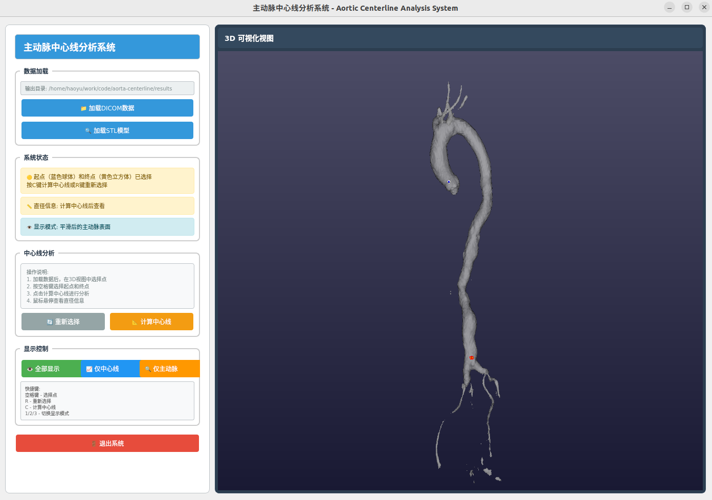
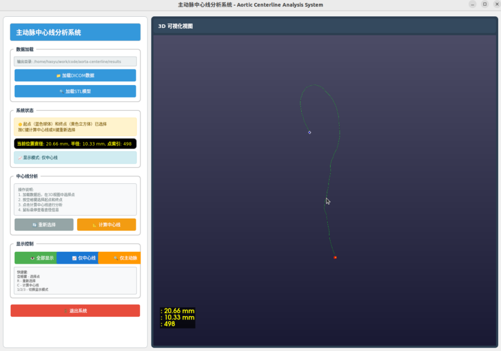

# Aorta Centerline Analysis System

An end-to-end pipeline for automatic aorta segmentation, 3D surface reconstruction, centerline extraction, and diameter computation from CT scans. It combines a deep learning-based segmentation model (3D RUNet) with the Vascular Modeling Toolkit (VMTK) and provides an interactive 3D visualization GUI.

> [中文文档](README_zh.md)

## Features

- **DICOM to NIfTI conversion** — Batch load CT slices and convert to volumetric NIfTI format
- **Deep learning segmentation** — Automatic aorta segmentation using a 3D Residual U-Net (RUNet)
- **3D mesh generation** — Marching cubes surface extraction with Laplacian smoothing, exported as STL
- **Interactive centerline extraction** — Click-based start/end point selection on the 3D aorta surface, powered by VMTK
- **Real-time diameter measurement** — Hover over any point on the centerline to view the local aortic diameter
- **Multi-mode 3D visualization** — Toggle between surface-only, centerline-only, and combined views
- **CSV data export** — Centerline coordinates and diameters saved for further analysis
- **Logging** — Full session logging to `results/log.txt`

## Screenshots

| Step | Description |
|------|-------------|
|  | **1. Aorta Segmentation** — The aorta is automatically segmented from CT DICOM data using the RUNet deep learning model. |
|  | **2. Start/End Point Selection** — Select the start (blue sphere) and end (yellow cube) points on the 3D aorta surface by hovering and pressing the spacebar. |
|  | **3. Centerline & Diameter** — The computed centerline is displayed in green. Hover over any point to see the local aortic diameter. |

## Project Structure

```
aorta-centerline/
├── main.py                  # PyQt5 GUI application (main entry)
├── model/
│   └── Iteration_3500       # Pre-trained RUNet model weights
├── networks/
│   ├── runet.py             # 3D Residual U-Net architecture
│   └── building_blocks.py   # Residual blocks and utilities
├── inference/
│   ├── inference_sega.py    # Segmentation inference engine
│   └── meshing.py           # NIfTI → mesh conversion
├── preprocessing/
│   └── preprocessing_volumetric.py  # Resampling and normalization
├── augmentation/
│   ├── volumetric.py        # Volumetric augmentation transforms
│   ├── aug.py               # Transform composition utilities
│   └── torchio.py           # TorchIO-based augmentation pipelines
├── helpers/
│   ├── utils.py             # Normalization and I/O utilities
│   ├── cost_functions.py    # Training loss functions (Dice, Hausdorff, etc.)
│   └── hausdorff.py         # Hausdorff distance loss implementation
├── paths/
│   └── paths.py             # Path configuration
├── results/                 # Output directory (created at runtime)
│   ├── output_volume.nii.gz # Converted NIfTI volume
│   ├── pred_mask.nii.gz     # Segmentation mask
│   ├── pred_mask_3d_model.stl  # 3D surface mesh
│   ├── centerline_diameters.csv # Centerline coordinates & diameters
│   └── log.txt              # Session log
└── img/                     # Documentation images
```

## Installation

### Step 1: Create Conda Environment

```bash
conda create -n vmtk -c conda-forge python=3.10 itk=5.3 vmtk vtk pyqt pyvista pyvistaqt scikit-image nibabel SimpleITK pandas
```

> **Note:** This installs VMTK 1.5.0 with ITK 5.3, which is newer than the official VMTK 1.4.0 release and includes the `vmtkCenterlines` module used in this project.

### Step 2: Install PyTorch and Additional Dependencies

**CPU-only:**
```bash
pip3 install torch torchvision --index-url https://download.pytorch.org/whl/cpu
```

**With GPU (CUDA 12.6):**
```bash
pip3 install torch torchvision --index-url https://download.pytorch.org/whl/cu126
```

**Additional packages:**
```bash
pip install torchsummary torchio
```

### Step 3: Prepare the Segmentation Model

Place the trained aorta segmentation model checkpoint in the `model/` directory:

```
model/Iteration_3500
```

The default checkpoint file is named `Iteration_3500` (trained for 3,500 iterations).

- **Model training source code:** [SEGA_MW_2023](https://github.com/MWod/SEGA_MW_2023/tree/main)
- **Pre-trained model download:** [Baidu Pan](https://pan.baidu.com/s/1f3R1wVMRo6gShNpKLl_h0g?pwd=AORT) (code: `AORT`)

## Usage

### Launch the GUI

```bash
python main.py
```

**For dual-GPU systems (NVIDIA + Intel):**
```bash
__NV_PRIME_RENDER_OFFLOAD=1 __GLX_VENDOR_LIBRARY_NAME=nvidia __VK_LAYER_NV_optimus=NVIDIA_only python main.py
```

### Workflow

1. **Load Data** — Click "📁 加载DICOM数据" (Load DICOM Data) and select a folder containing CT DICOM slices. The system will automatically:
   - Convert DICOM to NIfTI
   - Run deep learning segmentation
   - Generate a 3D STL surface mesh
   - Load and smooth the mesh for display

   Alternatively, click "🔍 加载STL模型" (Load STL Model) to load a pre-existing STL file.

2. **Select Start/End Points** — Move your mouse over the aorta surface to see a preview marker:
   - Press **Spacebar** to select the **start point** (blue sphere)
   - Move to another location and press **Spacebar** again to select the **end point** (yellow cube)
   - Press **R** to reset the selection

3. **Compute Centerline** — Click "📐 计算中心线" (Compute Centerline) or press **C** to calculate the centerline between the selected points. VMTK will compute the shortest path through the vessel lumen.

4. **View Results** — After computation:
   - **"👁️ 全部显示" / Key 1** — Show both surface and centerline
   - **"📈 仅中心线" / Key 2** — Show centerline only
   - **"🔍 仅主动脉" / Key 3** — Show aorta surface only
   - Hover over the centerline to view real-time diameter at any point

### Output Files

All results are saved in the `results/` directory:

| File | Description |
|------|-------------|
| `output_volume.nii.gz` | NIfTI volume converted from DICOM |
| `pred_mask.nii.gz` | Binary segmentation mask |
| `pred_mask_3d_model.stl` | 3D aorta surface mesh (smoothed) |
| `centerline_diameters.csv` | Centerline points with coordinates and diameters (columns: PointIndex, X, Y, Z, Radius, Diameter) |
| `log.txt` | Full session log |

### Keyboard Shortcuts

| Key | Action |
|-----|--------|
| `Space` | Select start/end point on the aorta surface |
| `C` | Compute centerline |
| `R` | Reset point selection |
| `1` | Show both surface and centerline |
| `2` | Show centerline only |
| `3` | Show surface only |

## Technical Details

- **Segmentation Model:** 3D Residual U-Net (RUNet) with 6-level encoder-decoder architecture
- **Input Normalization:** CT window [-100, 400] HU
- **Inference Resolution:** 224 × 224 × 300 voxels
- **Post-processing:** Binary thresholding (0.5) + small connected component removal
- **Surface Smoothing:** Laplacian smoothing (50 iterations, relaxation factor 0.1)
- **Centerline Method:** VMTK `vmtkCenterlines` with pointlist seed selector and maximum inscribed sphere radius

## License

This project is licensed under the MIT License. See [LICENSE](LICENSE) for details.

## Acknowledgments

This project builds upon the excellent work of:

- **[SEGA_MW_2023](https://github.com/MWod/SEGA_MW_2023)** — The aorta segmentation model training framework by [MWod](https://github.com/MWod). We are grateful for the open-source release of the training code and methodology. The pre-trained RUNet model used in this project was trained using the SEGA framework.
- **[VMTK](http://www.vmtk.org/)** — The Vascular Modeling Toolkit for centerline extraction and vascular analysis.
- **[TorchIO](https://github.com/fepegar/torchio)** — Medical image augmentation and preprocessing library, used in the data augmentation pipeline.
